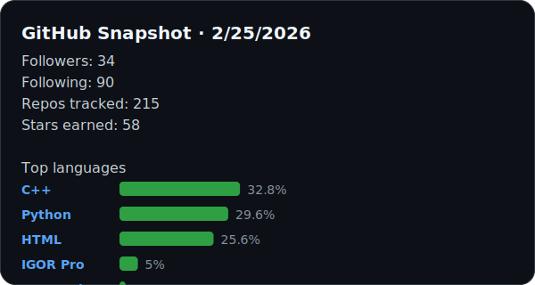

Greetings, my name is Chen (KedoKudo) and welcome to my Github front page. Last update is on Sunday, February 22, 2026 at 3:33 AM CST.

## 👨‍🔬 About Me

I am a Computational Scientist at Oak Ridge National Laboratory, focusing on scientific software development for neutron data reduction and analysis. My work also explores applications of artificial intelligence in scientific computing.

## 🛠️ Technologies & Skills

## 🚀 Featured Projects

- [iMars3D](https://github.com/ornlneutronimaging/iMars3D) – Neutron imaging reconstruction workflow powering instrument operations at ORNL.
- [Mantid](https://github.com/mantidproject/mantid) – Collaborative neutron and muon scattering analysis suite with global contributors.
- [mcpevent2hist](https://github.com/ornlneutronimaging/mcpevent2hist) – Transforms raw MCP detector events into analysis-ready histograms.
- [iBeatles](https://github.com/ornlneutronimaging/iBeatles) – Utility collection that streamlines neutron imaging beamline experiments.
- [PLEIADES](https://github.com/lanl/PLEIADES) – LANL/ORNL research on scalable, AI-enhanced experimental workflows.
- [DocSage](https://github.com/KedoKudo/DocSage) – Lightweight knowledge assistant for technical documentation and lab notebooks.

## 📊 Stats

  

Last sync: Sunday, February 22, 2026 at 3:33 AM CST · 34 followers · 215 repos tracked (195 public) · 57 stars · Top languages: C++ (32.8%), Python (29.6%), HTML (25.6%), IGOR Pro (5%), TypeScript (1.7%), C (1.1%)

## 📫 Connect With Me

